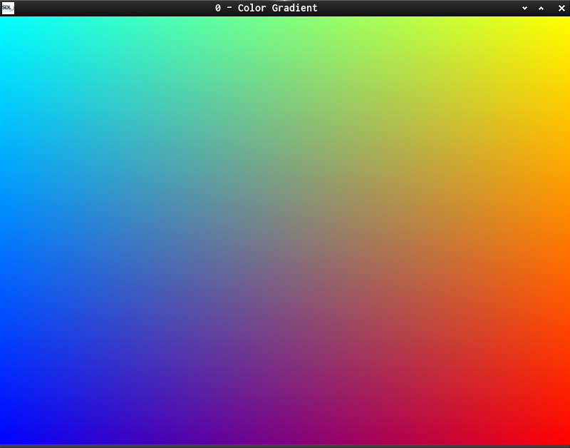
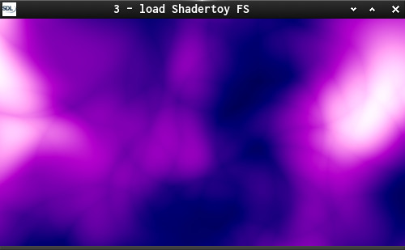

### This is a starter series about GLSL Shaders using SDL2 as OpenGL Helper and a bit Shader-Language for C-Coders.

0 - Init a simple OpenGL Window  
1 - Draw and rotate rectangles  
texture_SOIL texture_SDL2 - Render Texture  
2 - Working with shaders  
3 - Load a [shadertoy](https://www.shadertoy.com/) shader  
3a1 - press n to create new shader, will open in Editor  
  if file is changed and saved. press c to compile.  
3a2 - should track if file in Editor was written and auto-compile.  

When working with shaders use left mouse button and mouse motion to change view.  
When working with multiple shaders use middle mouse button to switch shaders.  

The work on Shader Toy Fragment Shaders has been split out to an extra project:  
[Shade it!](https://github.com/Acry/Shade-it-), enjoy!

Useful links:  
[SDL2](https://www.libsdl.org/) | [SDL-Discourse](https://discourse.libsdl.org) | [SDL2-Example Code](https://gist.github.com/Acry/baa861b8e370c6eddbb18519c487d9d8) | [N. Nopper-Code](https://github.com/McNopper/OpenGL) | [McKesson-Book](https://paroj.github.io/gltut/) | [Íñigo Quílez](http://www.iquilezles.org/prods/index.htm)  

Screenshots:  
  
  
  

[Get in touch on SDL-Discourse](https://discourse.libsdl.org/u/Acry/summary)
