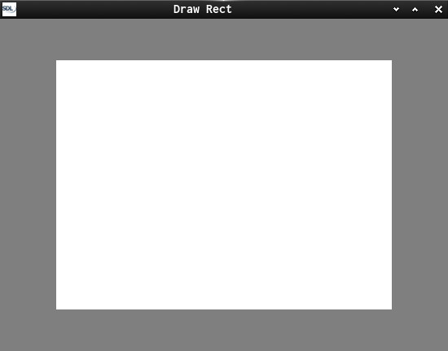
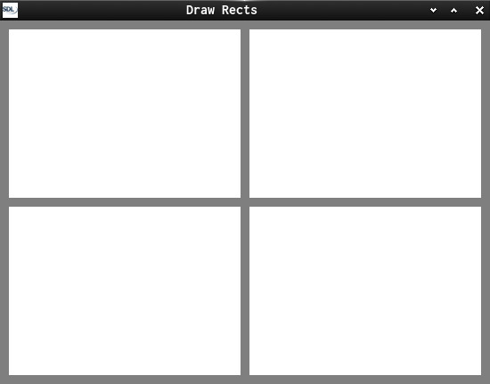
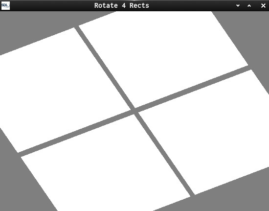
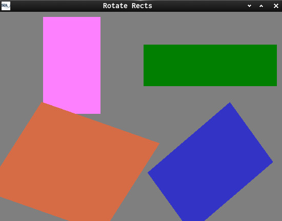
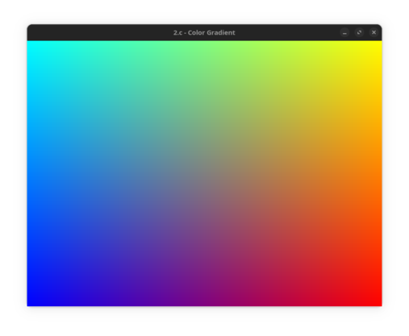
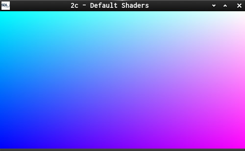
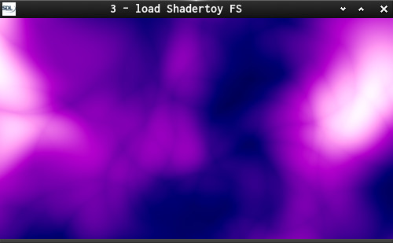

# OpenGL - Playground

This is a series of OpenGL examples.

Some OpenGL 2.1 and 3.3 examples, using SDL2 and GLEW as function wrangler.
And a bit GLSL for C-Coders.

## Legacy OpenGL

 `Immediate mode` is nice because the entry barrier is extremely low.

- `0` - Init a simple OpenGL Window, on Linux it defaults to OpenGL 2.1
- `1` - Draw rectangle

- `1a` - Draw rectangles

- `1b` - Rotate rectangles uniformly

- `1c` - Rotate rectangles individually

- `1d` - SGI Teapot Demo ported to SDL2 (**TBD**)
<http://ftp.funet.fi/pub/sci/graphics/packages/objects/teasetorig.gz>

- `1e` - SGI Atlantis Demo ported to SDL2 (**TBD**)

## Modern OpenGL

Retained-mode using `VAO` / `VBO`

It is much harder to do anything at all with modern OpenGL, but it is in fact easier once you are over the initial
hurdle (and, much faster).

## GLSL - Shaders

2 - Shader-Setup

`2d.c` - uniform mouse and switch multiple shaders on middle mouse button

## Shadertoy - Fragment Shaders

`3` - Load a [shadertoy](https://www.shadertoy.com/) shader from command line and switch between shaders with middle mouse button.

Try:

- `./3 ../assets/shader/shadertoy/4ltSRS_nebula_smoke`
- `./3 ../assets/shader/shadertoy/Ms2SD1_Seascape`

`3a1` - press `n` to create new shader, will open in Editor
  if file is changed and saved. press `c` to compile.

`3a2` - should track if file in Editor was written and **auto-compile**.

- When working with shaders use left mouse button and mouse motion to change view.
- When working with multiple shaders use middle mouse button to switch shaders.

The work on Shader Toy Fragment Shaders has been split out to an extra project:
[Shade it!](https://github.com/Acry/Shade-it-)

## Image Texture Libraries

Some examples to load image textures with selected libraries:

- texture_devil
- texture_SDL2, (flipping SDL2 surfaces manually)
- texture_SOIL
- texture_stb_image

## Dependencies

`pacman -S soil devil sdl2 sdl2_image glew glu`

## Useful links

[SDL2](https://www.libsdl.org/) | [SDL-Discourse](https://discourse.libsdl.org) | [SDL2-Example Code](https://gist.github.com/Acry/baa861b8e370c6eddbb18519c487d9d8) | [N. Nopper-Code](https://github.com/McNopper/OpenGL) | [McKesson-Book](https://paroj.github.io/gltut/) | [Íñigo Quílez](http://www.iquilezles.org/prods/index.htm)
